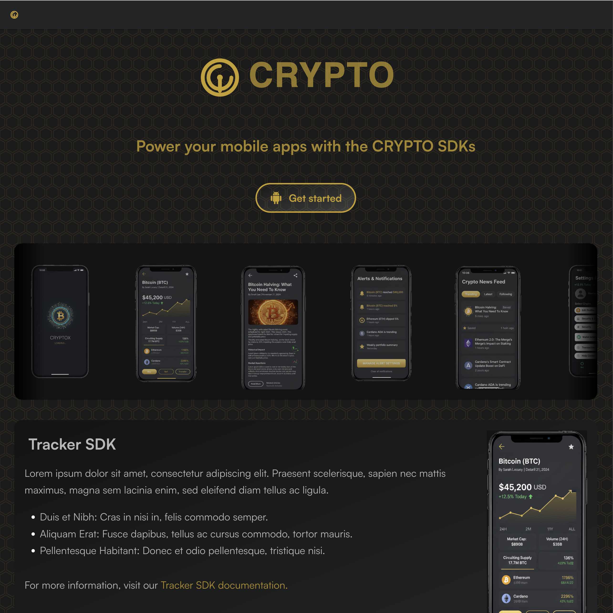
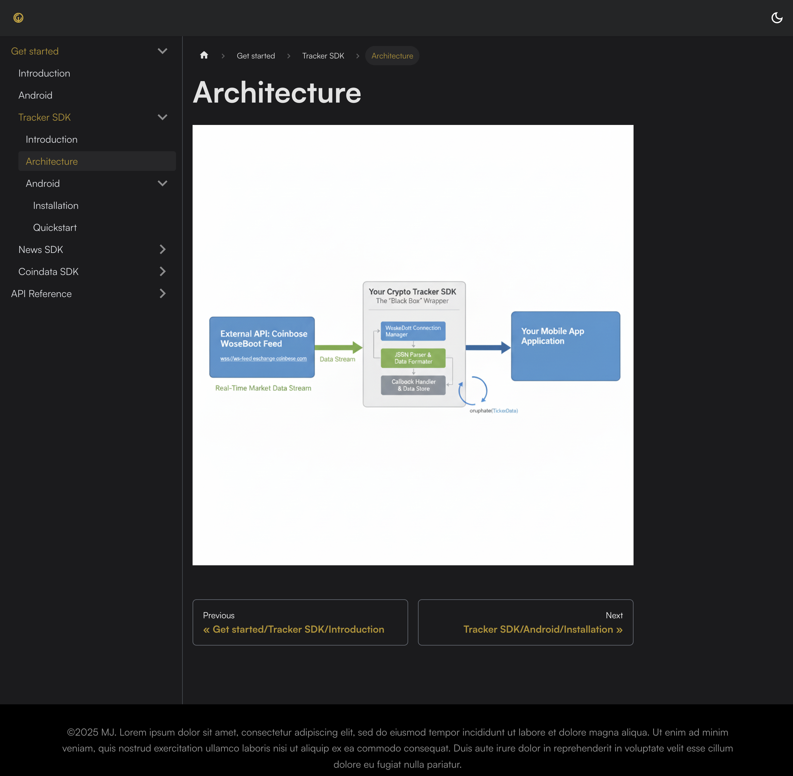
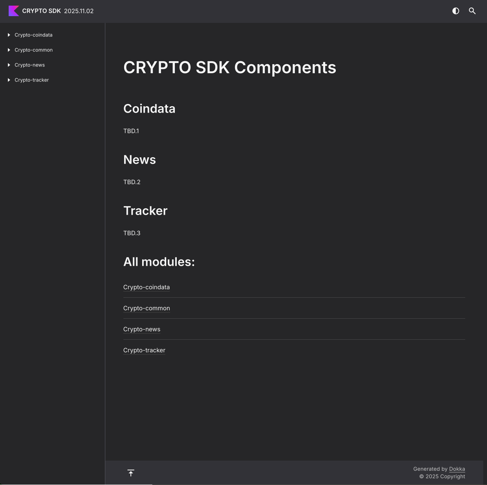

Dashboard HTML page for CRYPTO SDK.
The destination is TBD.

# Installation

If you want to preview your changes you need to install the site and run it locally.
Follow these steps to install the Dashboard HTML page for all platforms providing CRYPTO SDK.

## Prerequisites

- Node.js (version 14.x or later)
- npm (version 6.x or later)

Installation instructions can be found at https://nodejs.org/en/download/package-manager.

## Steps

1. **Clone the repository**:
    ```sh
    git clone https://github.com/kotoMJ/android-sdk-ecosystem-doc
    cd android-sdk-ecosystem-doc
    ```
2. **Install yarn**:
    ```sh
    npm install -g yarn
    ```

3. **Install dependencies**:
    ```sh
    yarn install
    ```
   NODE_ENV is set to 'development'

4. **Run the project on dev**:
    ```sh
    yarn start
    ```

5. **Open in browser**:
   Open your browser and navigate to `http://localhost:3000` to view the site.


6. **Run the project on production**
    ```sh
    yarn build
    ```
   NODE_ENV is set to 'production'

# Adding a new page

To add a new page to the dashboard, follow these steps:

1. **Create a new page**:
   Create new MD file in the `src/docs` directory.
2. **Create a new dropdown**:
   Create a new folder in the `src/docs` directory.

Sidebar should be automatically updated with the new dropdown and page.
If you are having troubles read through the [Docusaurus documentation](https://docusaurus.io/docs/docs-introduction).

# Updating autogenerated Android Reference.

Copy outputs to the `static/android-reference/YYYY.MM.AB` folder.

In the final documentation the folder with latest date/higher number will be marked as the main.

# Deployment

# How does it looks like







